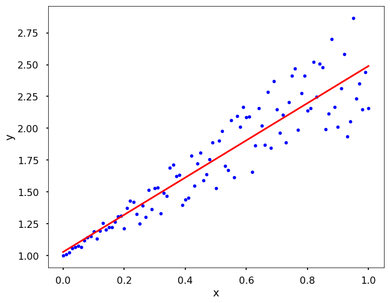

## Apa itu Analisis Regresi?

Analisis Regresi adalah suatu bagian dari statistika yang membahas atau membicarakan hungan antar variabel-varial yang dibentuk dalam suatu model matematika.

Tujuan utama dari analisis regresi adalah memahami pola hubungan antara variabel-variabel tersebut dan membuat prediksi atau estimasi nilai variabel dependen berdasarkan nilai variabel independen.

Analisis regresi membantu dalam memahami sejauh mana dan bagaimana satu atau lebih variabel independen berkaitan dengan variabel dependen. Ini membantu dalam mengidentifikasi pola dan trend dalam data.

<figure>
  
  <figcaption>
Gambar1: Grafik Linear Regression</figcaption>
</figure>

Dalam konteks regresi linear, hubungan antara variabel independen dan dependen dimodelkan sebagai suatu garis lurus, sedangkan dalam regresi non-linear, hubungan tersebut dapat memiliki bentuk fungsi matematis yang lebih kompleks. Model persamaan matematis regresi linear yang dirancang adalah  

$$
\begin{align}
 Y = \alpha + \beta X + \varepsilon
\end{align}
$$

di mana:  
$Y$ = variabel dependen (tidak bebas),  
$X$ = variabel independen (bebas),  
$\alpha$ dan $\beta$ = parameter,  
$\varepsilon$ = kekeliruan.

## Metode Kuadrat Terkecil (Least-Squares Method)

Permasalahan yang timbul dari model di atas adalah bagaimana cara menentukan harga $a$ dan $b$. Salah satu metode yang sering digunakan adalah Metode Kuadrat Terkecil yang bertujuan untuk meminimumkan kuadrat kesalahan $e$ sehingga nilai regresinya akan mendekati nilai yang sesungguhnya.  
 
Dalam Metode Kuadrat Terkecil tidak perlu diketahui atau uji apakah pengamatan tersebut berasal dari suatu dustrubusi atau tidak. Karena berhadapan dengan $n$ pengamatan dari data berpasangan atau $(x_i, y_i),...,(x_n, y_n)$.

Maka model populasi di atas dapat ditulis:

$$
\begin{align}
 Y_i = \alpha + \beta x_i + \varepsilon_i, i=1,2,3,...,n
\end{align}
$$

dengan asumsi $\varepsilon_i$ menngikuti distribusi normal dengan rata-rata nol dan varians $\sigma^2$.

Dari persamaan (2) dengan menggunakan Metode Kuadrat Terkecil diperoleh persamaan linear sebagai berikut:

$$
\begin{align}
 \hat{y} = a + bx
\end{align}
$$
dengan:  
$a$ adalah kelandaian (slope) kurva garis lurus,  
$b$ menyatakan perubahan rata-rata variabel untuk setiap variabel $x$ sebesar satu unit.

Persamaan regresi ini dapat juga dipergunakan untuk menggambarkan keadaan yang akan datang yakni dengan mensubstitusikan variabel bebas ($X$) yang akan diselidiki ke persamaan regresi yang telah diperoleh. Apabila variabel bebas yang diselidiki ada di antara nilai-nilai variabel bebas yang lainnya dinamakan **Interpolasi**, jika sebaliknya dinamakan **Extrapolasi**.

## Uji Koefisien Regresi dan Uji Linearitas

Pada saat meninjau kecenderungan dari pada diagram pencar yang dianggap mengelompok disekitar garis lurus makan pada saat itu juga dihipotesiskan bahwa regresi itu linear.

Karenanya hipotesis tersebut harus dibuktikan. Hal ini dilakukan dnegan melakukan suatu uji linearitas dan uji koefisien regresi, sehingga model regresi yang dihipotesiskan itu dapat atau tidak dapat digunakan (merupakan kesimpulan).

Jika ternyata hipotesis ditolak maka kita harus menentukan persamaan regresi non linear yang mana cocok dengan hasil observaasi tersebut. Apabila ingin mengetahui variabel $Y$ saling bebas dengan variabel $X$ atau apakah nilai-nilai dari variabel $X$ dapat dipergunakan untuk menaksir variabel $Y$  atau apakah persamaan regresi linear atau tidak. Untuk mengetahui hal tersebut harus dilakukan dengan suatu pengujian dan menggunakan daftar Anava.

Bentuk hipotesisnya adalah

$H_0: \beta = 0 \rightarrow$ Variabel $Y$ bebas dari variabel $X$ atau koefisien arah regresi tidak ada artinya.  
$H_1: \beta \neq 0 \rightarrow$
Variabel $Y$ tidak bebas dari variabel $X$ atau koefisien arah regresi berarti.

Untuk uji linearitas hipotesis adalah

$H_0:$ Persamaan regresi linear.  
$H_1:$ Persamaan regresi tidak linear.

Analisis variansi untuk menguji signifikansi model regresi dapat dirangkum dalam Table
ANOVA (Analisis of Variansi) model regresi sebagai berikut.

| Sumber   | $Dk$    | $Jk$   |
| -------- | ------- |------- |
| Regresi  | 1       | $b\{\Sigma X_i Y_i - \frac{(\Sigma X_i Y_i)}{n}\}$      |
| Residu   | $n-2$   | $b\{\Sigma X_i Y_i - \frac{(\Sigma X_i Y_i)}{n}\} - \{(\Sigma Y_i)^2 - \frac{(\Sigma Y_i)^2}{n}\}$         |
| Total    | $n-1$   | $(\Sigma Y_i)^2 - \frac{(\Sigma Y_i)^2}{n}$                  |

Daftar Anova di atas dapat diubah menjadi bentuk daftar anova dengan meninjau regresi $a$, yang tidak lain merupakan sumber variansi yang dijadikan faktor koreksi.

| Sumber          | $Dk$    | $Jk$                      |
| --------        | ------- |-------                    |
| Regresi $a$     | 1       | $\frac{(\Sigma Y_i)^2}{n}$                                                       |
| Regresi $b/a$   | 1       | $b\{\Sigma X_i Y_i - \frac{(\Sigma X_i Y_i)}{n}\} $                               |
| Residu          | $n-2$   | ${\Sigma Y_i}^2 - \frac{(\Sigma Y_i)^2}{n} - b\{\Sigma X_i Y_i - \frac{(\Sigma X_i Y_i)}{n}\}$                                         |
| Total    | $n-1$   | ${\Sigma Y_i}^2 $                |

Catatan: Dk adalah derajat kebebasan, Jk adalah jumlah kuadrat.

$F_{perhitungan} = {\frac{\text{Jk regresi b/a}}{(\text{Jk residu) / (n-2})}}$

Tolak $H_0$ jika
$F_{per} > F_{\alpha}; 1; n-2$

Tabel di bawah ini adalah gabungan antara pengujian koefisien regresi dengan uji linearitas.
| Sumber          | $Dk$    | $Jk$    | $Rjk$           |
| --------        | ------- |-------  |-------          |
| Regresi $a$     | 1       | $\frac{(\Sigma Y_i)^2}{n}$                           | 
| Regresi $b/a$   | 1       | $b\{\Sigma X_i Y_i - \frac{(\Sigma X_i Y_i)}{n}\} $   | $\text{Jk regresi b/a}$|
| Residu          | $n-2$   | ${\Sigma Y_i}^2 - \frac{(\Sigma Y_i)^2}{n} - b\{\Sigma X_i Y_i - \frac{(\Sigma X_i Y_i)}{n}\}$             | ${\frac{\text{Jk Residu}}{n-2}}$                     |
|Tuna Cocok       | $k-2$   | $\text{Jk residu - Jk Galat}$           | ${\frac{\text{Jk Residu}}{k-2}}$|
|Galat            | $n-k$   | $\Sigma\Sigma(Y_{ju} - \bar{Y})^2$
| Total           | $n-1$   | ${\Sigma Y_i}^2 $        |

untuk koefisien regresi

$F_{perhitungan} = {\frac{\text{(Jk Regresi b/a)}}{(\text{Jk Residu) / (n-2})}}$

untuk uji linearitas

$F_{perhitungan} = {\frac{\text{(Jk Tuna cook) / (k-2)}}{(\text{Jk Galat) / (n-2})}}$

